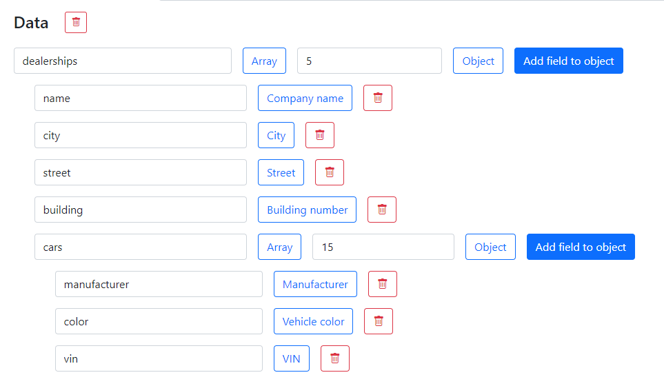
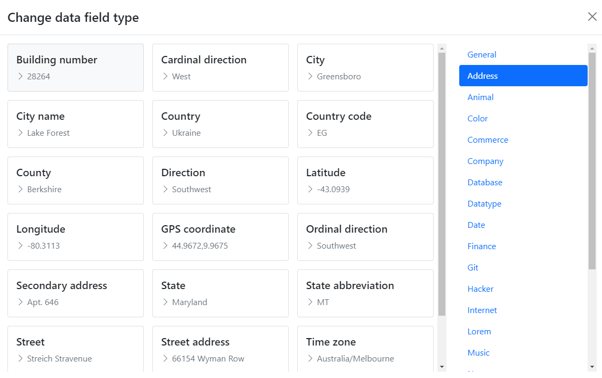
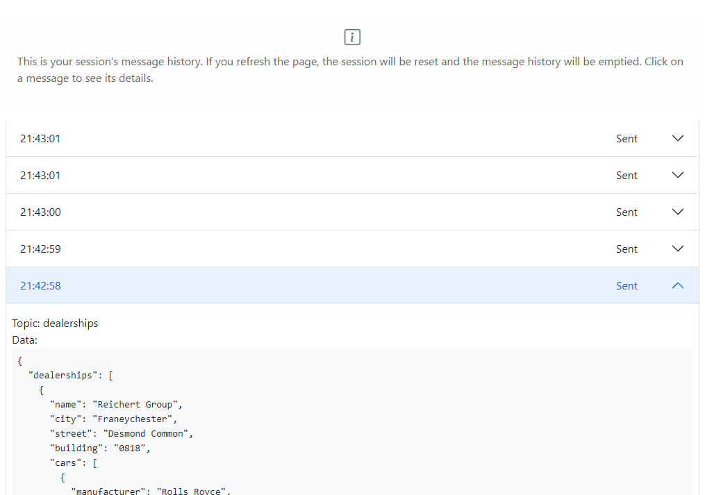

  

Apache Kafka JSON message faking

<h1 align="center">
👷 🚧 Currently under construction 🏗️ 👷‍♀️
</h1>

## Motivation 🤔

When developing applications which use Apache Kafka as a messaging queue, it is sometimes good to have fake data flowing through it for development purposes. Kafka Faker allows you to do that conveniently through a web UI.

## Features 📋

- Fake data generation by [Faker](https://fakerjs.dev/)
- Create dynamic JSON objects: nest objects, arrays
- Send messages manually or periodically
- Save and load message schemas
- See the session's message history
- Containerized

## Demo 🖼️

You can try out the demo mode of the UI [here](https://benasb.github.io/kafka-faker)!

Disclaimer: this application is inteded for desktop/laptop users, so the design is not mobile responsive.

## Application stack 📚

1. [Front end](./front-end/README.md)
2. [Back end](./back-end/README.md)
3. Kafka cluster
4. MySQL database

## Try it out 🕹️

WIP
